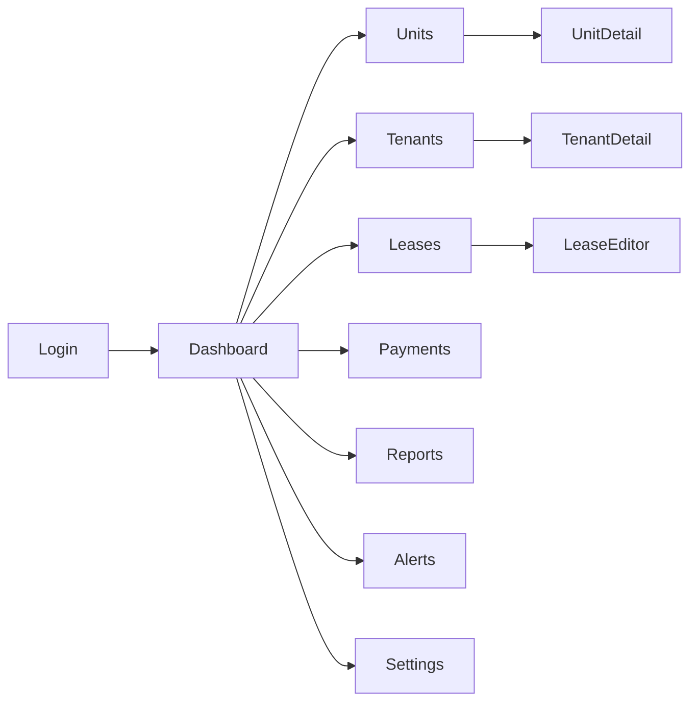

# 나의 부동산 관리 프로그램 — UI 화면 설계 & 와이어프레임
작성일: 2025-08-17

본 문서는 **SB Admin 2** 스타일의 좌측 사이드바 + 상단 바 레이아웃을 기준으로 한 **로우파이(low‑fi) 와이어프레임**과 **화면 설계**를 정의합니다.  
아래 PNG 와 PDF는 다운로드하여 검토/주석 가능하며, 이 마크다운은 GitHub/문서화에 바로 사용 가능합니다.

## 다운로드
- **모든 PNG (zip)**: `wireframes_png.zip`
- **모음 PDF**: `wireframes.pdf`

## 네비게이션 구조 (Sitemap)

---

## 공통 레이아웃
- **Top Bar**: 제품명, 전역 검색, 프로필 메뉴, 알림
- **Left Sidebar**: Dashboard / Units / Tenants / Leases / Payments / Reports / Alerts / Settings
- **Content**: 페이지별 카드/표/폼

---

## 화면별 설계

### 0) 로그인 (Login) — `00_login.png`
**목적**: 인증 및 역할(관리자/매니저) 부여  
**구성**: 이메일, 비밀번호, 로그인 버튼, 버전 정보  
**검증**: 이메일 포맷, 비밀번호 최소 8자  
**오류 처리**: 로그인 실패 시 상단 경고 토스트

### 1) 대시보드 (Dashboard) — `01_dashboard.png`
**목적**: 핵심 KPI/활동을 한눈에 파악  
**위젯**: KPI 4개(점유율, 공실, 월수익, 연체 건수), 점유율/수익 차트, 최근 활동 로그  
**상호작용**: 기간 필터(이번달/분기/연도), 카드 클릭 시 상세 페이지 이동

### 2) 유닛 목록 (Units List) — `02_units_list.png`
**목적**: 모든 호실을 테이블로 관리  
**필터**: 검색, 상태(공실/점유), 타입, 면적  
**컬럼**: Unit / Type / Size / Status / Current Tenant / Actions  
**행동**: 신규 등록, 일괄 상태 변경, CSV 내보내기

### 3) 유닛 상세 (Unit Detail) — `03_unit_detail.png`
**목적**: 호실 메타 + 연결 계약/세입자 보기  
**블록**: 요약, 사진(썸네일), 연결 계약/세입자  
**행동**: 편집, 사진 업로드, 현재 계약으로 이동

### 4) 세입자 목록 (Tenants List) — `04_tenants_list.png`
**목적**: 세입자 전반 관리  
**필터**: 검색, 상태(입주/퇴거/미납), 유닛  
**컬럼**: Name / Phone / Email / Status / Unit / Actions  
**행동**: 신규 등록, CSV 내보내기, 상태 배지

### 5) 세입자 상세 (Tenant Detail) — `05_tenant_detail.png`
**목적**: 프로필/연락처/문서/히스토리  
**블록**: Profile & Contact, Documents, Activity/Notes  
**행동**: 연락처 수정, 문서 업/다운로드, 메모 추가

### 6) 계약 목록 (Leases List) — `06_leases_list.png`
**목적**: 계약 전반 및 갱신 관리  
**필터**: 기간, 상태(활성/만료예정/만료), 유닛/세입자  
**컬럼**: Lease# / Unit / Tenant / Start / End / Status  
**행동**: 신규 계약, 연장 시작, PDF 계약서 다운로드

### 7) 계약 편집 (Lease Editor) — `07_lease_editor.png`
**목적**: 계약 생성/수정 마법사  
**스텝**: Unit → Tenant → Terms → Attachments → Review  
**검증**: 필수 필드, 기간/금액 유효성, 첨부 포맷  
**행동**: 저장/취소, 초안 저장, PDF 생성

### 8) 납부 (Payments) — `08_payments.png`
**목적**: 월세 입금 레저/정산 관리  
**필터**: 기간, 상태(완납/미납/부분), 결제수단  
**컬럼**: Date / Tenant / Unit / Amount / Method / Status  
**행동**: 납부 등록, 영수증 업로드, 정산 내보내기

### 9) 보고서 (Reports) — `09_reports.png`
**목적**: 수익/연체/공실 등 지표 리포트  
**카드**: Monthly Revenue, Arrears, Occupancy 등  
**내보내기**: CSV / PDF

### 10) 알림 & 캘린더 (Alerts & Calendar) — `10_alerts_calendar.png`
**목적**: 갱신 예정/미납 알림과 일정 확인  
**구성**: 월 캘린더, 우측에 다가오는 항목 리스트  
**행동**: 알림 해제/보류, 관련 상세로 드릴다운

### 11) 설정 (Settings) — `11_settings.png`
**목적**: 조직/사용자/백업/연동 관리  
**블록**: Org Profile, Users & Roles, Backups, Integrations  
**행동**: 사용자 초대/권한, 백업 생성/복구, 외부 연동 키 관리

---

## 컴포넌트 가이드
- **테이블**: 고정 헤더, 행 hover, 선택 체크박스, 페이지네이션(25/50/100)
- **폼**: 라벨 상단 정렬, 필수(*) 표기, 실시간 검증 메시지
- **필터 바**: 좌측 조건, 우측 주요 CTA(“Add New” 등)
- **토스트/모달**: 성공/경고/오류 색상 차등

## 접근성 & 반응형
- 키보드 탐색 가능(Tab/Shift+Tab), 폼 에러 ARIA 표시
- 1200/992/768 브레이크포인트에서 1~3열 레이아웃 재배치

## 추후 하이파이(Hi‑fi) 전환 팁
- SB Admin 2 카드/테이블 컴포넌트 적용
- 차트: Chart.js (점유율/수익), 캘린더: FullCalendar
